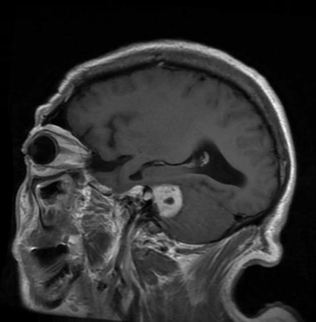
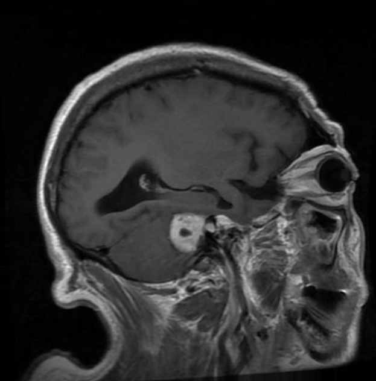
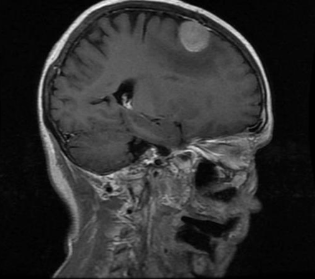

#BraTS 2023: Meningioma Segmentation (BraTS-MEN)

## Tabla de contenidos
1. [Sobre BraTS](#sobre-brats)
2. [Dataset: BraTS-MEN 2023](#dataset-brats-men-2023)
3. [Objetivo del proyecto](#objetivo-del-proyecto)
4. [Ejemplos de imágenes MRI](#ejemplos-de-imágenes-mri)
5. [Licencia y términos de uso](#licencia-y-términos-de-uso)
6. [Referencias y citaciones](#referencias-y-citaciones)

---

## Sobre BraTS

**Brain Tumor Segmentation (BraTS)** es un reto que se hace cada año de segmentación de tumores cerebrales en imágenes de resonancia magnética (MRI). Organizado conjuntamente por:
- **Radiological Society of North America (RSNA)**
- **American Society of Neuroradiology (ASNR)** 
- **MICCAI**.

BraTS es considerado uno de los benchmarks más influyentes en la comunidad de visión por computadora médica.

Desde su primera edición en 2012, BraTS ha impulsado el desarrollo de algoritmos automáticos de segmentación proporcionando datos anotados de alta calidad, etiquetados por expertos clínicos. La edición **2023** expandió el alcance del reto a múltiples tipos de tumores, incluyendo gliomas, meningiomas, metástasis, tumores pediátricos y poblaciones sub-saharianas, además de tareas adicionales como síntesis de modalidades MRI e inpainting.

Las imágenes de BraTS están estandarizadas en las siguientes modalidades MRI:
- **T1w** — T1 sin contraste
- **T1ce** — T1 con contraste (gadolinio)
- **T2w** — T2
- **T2-FLAIR** — Fluid Attenuated Inversion Recovery

Todas las imágenes están co-registradas al mismo espacio anatómico, con cráneo removido y resolución de 1 mm³ isotrópico.

---

## Dataset: BraTS-MEN 2023

| Atributo | Detalle |
|---|---|
| **Nombre completo** | BraTS 2023 — Meningioma Segmentation (BraTS-MEN) |
| **Reto asociado** | Challenge 3 de BraTS 2023 |
| **Tipo de tumor** | Meningioma intracraneal |
| **Modalidades** | T1w, T1ce, T2w, T2-FLAIR |
| **Formato** | NIfTI (`.nii.gz`) |
| **Acceso** | [Synapse ID: syn51156910](https://www.synapse.org/#!Synapse:syn51156910) |
| **Licencia** | [CC BY-NC 4.0](https://creativecommons.org/licenses/by-nc/4.0/) |

### Descripción clínica

Los **meningiomas** son los tumores intracraneales primarios más frecuentes, originándose en las meninges (membranas que recubren el cerebro y la médula espinal). Aunque la mayoría son benignos (grado I de la OMS), los de grado II y III presentan mayor recurrencia y requieren tratamiento agresivo. La segmentación precisa del tumor es clave para la planificación quirúrgica y radioterapéutica.

### Estructura del dataset

Los datos se organizan por paciente con la siguiente estructura de carpetas:

```
BraTS-MEN/
├── BraTS-MEN-00001/
│   ├── BraTS-MEN-00001-t1n.nii.gz
│   ├── BraTS-MEN-00001-t1c.nii.gz
│   ├── BraTS-MEN-00001-t2w.nii.gz
│   ├── BraTS-MEN-00001-t2f.nii.gz
│   └── BraTS-MEN-00001-seg.nii.gz   ← máscara de segmentación
└── ...
```

### Etiquetas de segmentación

| Valor | Región |
|---|---|
| `0` | Fondo (no tumor) |
| `1` | Tumor — región enhancing |
| `2` | Tumor — región no-enhancing / necrosis |
| `3` | Edema peritumoral |

¿Qué es un Edema peritumoral?

Es una acumulación anormal de líquido en el tejido cerebral que rodea un tumor, causando inflamación, aumento de la presión intracraneal y riesgo de hernias cerebrales. Es una complicación frecuente en gliomas y meningiomas, frecuentemente provocada por factores como el VEGF (factor de crecimiento endotelial vascular) que aumentan la permeabilidad vascular
---

## Objetivo del proyecto

Este repositorio documenta el desarrollo de un modelo de **segmentación automática de meningiomas** a partir de imágenes MRI multimodales del dataset BraTS-MEN 2023.

El proyecto busca:

- Explorar y preprocesar el dataset BraTS-MEN 2023.
- Implementar y comparar arquitecturas de deep learning para segmentación volumétrica 3D (e.g., U-Net, nnU-Net, Swin-UNETR).
- Evaluar el rendimiento con las métricas estándar de BraTS: **Dice Score** y **95th percentile Hausdorff Distance (HD95)** sobre las sub-regiones tumorales.
- Documentar todos los avances de forma reproducible en este repositorio.

---

## Ejemplos de imágenes MRI

> Las imágenes a continuación son capturas de cortes axiales de casos del dataset BraTS-MEN 2023, incluidas con fines ilustrativos y académicos bajo los términos CC BY-NC 4.0.
Son, además, proyecciones png de imágenes crudas, antes de procesar


| imagen | Visualización |
|---|---|
| Vista 1 |  
| Vsita 2 |  
| Vista 3 |  


*tabla 1. Imágenes crudas extraídas como proyecciones png del conjunto de datos [1].*

---

## Licencia y términos de uso

Los datos están sujetos a una licencia **CC BY-NC 4.0** (uso no comercial únicamente).

**Declaración de atribución requerida:**
> *"Data used in this publication were obtained as part of the Brain Tumor Segmentation (BraTS) Challenge project through Synapse ID: syn51156910."*

---

## Referencias y citaciones

Si usas este dataset o este repositorio, cita los siguientes trabajos:

**Dataset BraTS-MEN 2023:**

```
[1] Labella, D., et al. "The ASNR-MICCAI Brain Tumor Segmentation (BraTS) Challenge 2023:
    Intracranial Meningioma." arXiv:2305.07642 (2023).
    DOI: https://doi.org/10.48550/arXiv.2305.07642
```

**MedPerf (requerido para cualquier dataset BraTS):**

```
[2] A. Karargyris, R. Umeton, M.J. Sheller, et al. "Federated benchmarking of medical
    artificial intelligence with MedPerf". Nature Machine Intelligence. 5:799–810 (2023).
    DOI: https://doi.org/10.1038/s42256-023-00652-2
```

**BibTeX:**

```bibtex
@article{brats2023men,
  title   = {The ASNR-MICCAI Brain Tumor Segmentation (BraTS) Challenge 2023: Intracranial Meningioma},
  author  = {Labella, Dominic and others},
  journal = {arXiv preprint arXiv:2305.07642},
  year    = {2023},
  doi     = {10.48550/arXiv.2305.07642}
}

@article{medperf2023,
  title   = {Federated benchmarking of medical artificial intelligence with MedPerf},
  author  = {Karargyris, Alexandros and Umeton, Renato and Sheller, Micah J and others},
  journal = {Nature Machine Intelligence},
  volume  = {5},
  pages   = {799--810},
  year    = {2023},
  doi     = {10.1038/s42256-023-00652-2}
}
```

---

*Repositorio mantenido con fines académicos e investigativos. Uso no comercial bajo CC BY-NC 4.0.*