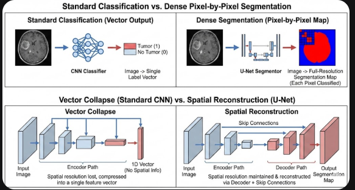
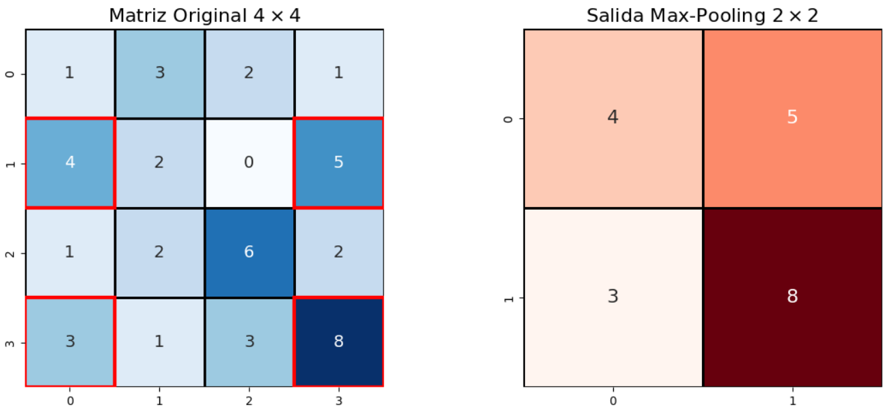
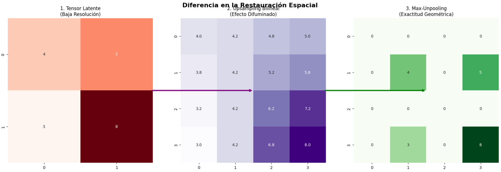
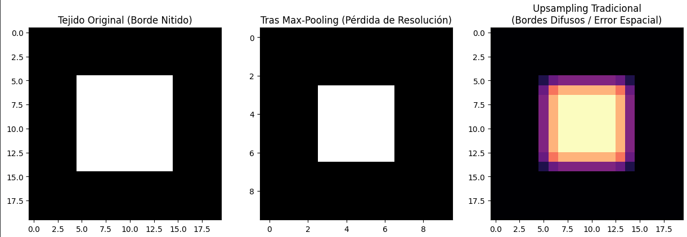
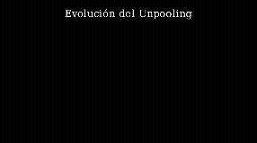

## 1. La Arquitectura U-Net: Fundamentos y Mecánica
La arquitectura U-Net es el estándar de facto para la segmentación semántica (clasificación densa píxel por píxel). A diferencia de las redes de clasificación tradicionales que colapsan una imagen en un vector perdiendo la noción del espacio, U-Net mantiene y reconstruye la resolución espacial geométrica.

### 1.1. Mecánica de Ingeniería:
U-Net es una red neuronal convolucional (CNN) simétrica dividida en tres fases operativas principales:

### Camino de Contracción (Encoder): 

Su objetivo es capturar el contexto global. Aplica convoluciones sucesivas seguidas de una función de activación no lineal, típicamente ReLU, definida como $f(x)=\max(0,x)$. Luego, aplica max-pooling para reducir la resolución espacial a la mitad, doblando la profundidad de los canales.

### Cuello de Botella (Bottleneck): 

Es el punto de máxima abstracción semántica y menor resolución espacial.

### Camino Expansivo (Decoder): 

Reconstruye la resolución espacial requerida para una máscara de segmentación perfecta mediante convoluciones transpuestas (upsampling).

### Conexiones de Salto (Skip Connections): 

Es la innovación crítica. Concatenan mapas de características de alta resolución del encoder directamente con el decoder. Esto fusiona el contexto global (baja resolución pero semántica profunda) con detalles espaciales finos (alta resolución geométrica). Esto es, no todo pasa hasta el bottleneck, sino que se permite que algunas características se pasen directamente al proceso del decoder, para aumentar la fidelidad de reconstrucción de la imagen.

### Veamos algunos ejemplos:

*Colapso de Vectores vs. Reconstrucción Espacial (U-Net)*:
Busquemos entender por qué es importante usar la U-net.
El colapso de vectores (el isomorfismo que existe entre una matriz $3x3$ y $R9$) daña la noción de cercanía que se tiene cuando vemos los vectores en el espacio versus como podemos entenderlos cuando los vemos "estirados" en $R9$.

*Ejemplo Numérico:*

Imaginemos una matriz de entradas $3 \times 3$ que representa una característica geométrica simple (una línea diagonal):
$$I = \begin{bmatrix} 1 & 0 & 0 \\ 0 & 1 & 0 \\ 0 & 0 & 1 \end{bmatrix}$$

Clasificación Estándar (Vector Collapse): 
Antes de la capa densa final, la matriz se aplana en un vector 1D: 
$V = [1, 0, 0, 0, 1, 0, 0, 0, 1]$. 
En este espacio $\mathbb{R}^9$, la distancia entre el primer '1' y el segundo '1' es de 3 índices. 

Esto significa que La red pierde la noción de que espacialmente estaban conectados (vecindad diagonal) y la geometría se destruye.

Segmentación Densa (U-Net): 
El tensor se comprime en el bottleneck a, digamos, un tensor de $1 \times 1 \times C$, pero la ruta expansiva (Decoder) y las Skip Connections fuerzan a la red a mapear las características latentes de vuelta a la cuadrícula $\mathbb{Z}^2$. 
La salida reconstruye un tensor $3 \times 3$ donde la relación de vecindad se preserva intacta para clasificar si cada píxel pertenece o no a un meningioma, por poner un ejemplo.

*Ejemplo Dinámico: Max-Pooling Paso a Paso*
El max-pooling es un filtro que recorre una matriz quedándose solo con el valor dominante, abstrayendo la característica y reduciendo el tamaño. El operador de Max-Pooling no solo abstrae características, sino que altera la dimensionalidad del tensor. Supongamos un canal de entrada: 

$I \in \mathbb{R}^{4 \times 4}$:$$I = \begin{bmatrix}\mathbf{1} & \mathbf{3} & \mathit{2} & \mathit{1} \\mathbf{4} & \mathbf{2} & \mathit{0} & \mathit{5} \1 & 2 & \mathbf{6} & \mathbf{2} \3 & 1 & \mathbf{3} & \mathbf{8}\end{bmatrix}$$

Usando un filtro de $2 \times 2$ con un salto (stride) de 2, el proceso mapea ésta matriz a un espacio más grueso, una grilla más gruesa  (coarse grid) $Y \in \mathbb{R}^{2 \times 2}$. la operación extrae el máximo de cada sub-cuadrante:

Cuadrante superior izquierdo: $\max(1, 3, 4, 2) = 4$
Cuadrante superior derecho: $\max(2, 1, 0, 5) = 5$
Cuadrante inferior izquierdo: $\max(1, 2, 3, 1) = 3$
Cuadrante inferior derecho: $\max(6, 2, 3, 8) = 8$

así pues:
$Y_{1,1} = \max(1, 3, 4, 2) = 4$
$Y_{1,2} = \max(2, 1, 0, 5) = 5$
$Y_{2,1} = \max(1, 2, 3, 1) = 3$
$Y_{2,2} = \max(6, 2, 3, 8) = 8$

Y con ésto: Tenemos la Matriz resultante $2 \times 2$: $$Y = \begin{bmatrix} 4 & 5 \\ 3 & 8 \end{bmatrix}$$

Ejemplo visual:

## 2. El Enfoque Matemático: U-Net como Problema de Control Óptimo
Más allá de su concepción de implementación, se ha demostrado que la arquitectura U-Net no es un apilamiento arbitrario de tensores, sino la solución estructural a un problema de control óptimo acoplado con un método multigrilla (Multigrid Method) no lineal.

### 2.1. La Red Neuronal como un Sistema Dinámico

En el marco del control óptimo, la propagación hacia adelante (forward pass) de un tensor a través de las capas de la red neuronal se modela como la discretización de una Ecuación Diferencial Ordinaria (EDO). Si tratamos la profundidad de la red como un tiempo continuo $t \in [0, T]$, la transformación del mapa de características $x(t)$  se modela rigurosamente como la evolución de $x(t)$ sujeto a un campo vectorial parametrizado por $\theta(t)$ (los pesos convolucionales):

$$\dot{x}(t) = \mathcal{F}(x(t), \theta(t))$$

o visto de otra manera:

$$\frac{dx}{dt} = f(x(t), \theta(t), t)$$

Donde $x(0)$ es la imagen médica de entrada y $x(T)$ es la máscara de segmentación final. El objetivo del entrenamiento es encontrar la trayectoria de los parámetros (los pesos convolucionales) $\theta(t)$ que minimicen una función de coste funcional (la pérdida empírica, como el Coeficiente Dice), sujeta a la dinámica del sistema. 

Minimizar la pérdida final (ej. Dice) es equivalente a resolver un problema de Control Óptimo, donde el algoritmo de Backpropagation actúa calculando el estado adjunto (costate) del sistema según el Principio del Máximo de Pontryagin.

### 2.2. U-Net como un Ciclo-V (V-Cycle) Multigrilla

El problema de optimizar tensores masivos de alta resolución (como un corte de MRI) es extremadamente costoso numéricamente, ya que los gradientes se estancan tratando de corregir errores globales. Aquí es donde la U-Net emula exactamente un Algoritmo Multigrilla en Ciclo-V.

Al resolver ecuaciones diferenciales espaciales, los solucionadores iterativos (como el método de Gauss-Seidel) eliminan rápidamente el error de alta frecuencia (ruido local y bordes), pero son matemáticamente ineficientes contra el error de baja frecuencia (desviaciones estructurales globales). La U-Net soluciona esto manipulando la resolución del dominio $\Omega$:

- Suavizado inicial (Smoother):
Las primeras convoluciones extraen características y eliminan el error local de alta frecuencia.

- Operador de Restricción ($I_h^{2h}$) (Encoder):
Matemáticamente, es una proyección lineal que transfiere un vector del espacio fino $\Omega_h$ al espacio grueso $\Omega_{2h}$. En la U-Net, esto se implementa mediante el Max-Pooling. Al extraer el máximo de un bloque $2 \times 2$, el operador filtra el detalle local. En esta grilla reducida, las variaciones globales (baja frecuencia) se "comprimen" espacialmente, transformándose en altas frecuencias relativas, lo que permite que las convoluciones profundas las resuelvan en pasos computacionales mínimos.
*Ejemplo operacional:* 
Un vector fino $x_h = [1, 5, 2, 8]$ restringido con un factor de 2 usando la norma máxima (el máximo entre ambos), se descompone entonces en los siguientes pasos:
paso 1: $x_h1 = [1, 5]$ y dado que tomamos el máximo entonces se queda el $5$.
Paso 2: $x_h2 = [2, 8]$ y dado que tomamos el máximo entonces se queda el $8$.
Así, ese vector inicial $x_h = [1, 5, 2, 8]$ se convierte en $x_{2h} = I_h^{2h} x_h = [5, 8]$.

- Operador de Prolongación ($I_{2h}^h$) (Decoder): 
Es el mapeo inverso. Toma la solución calculada en el espacio latente grueso $\Omega_{2h}$ y la interpola de vuelta a la grilla fina $\Omega_h$ original. En la red, esto es la Convolución Transpuesta (Upsampling).
*Ejemplo operacional:*
Prolongar el vector $x_{2h} = [5, 8]$ mediante interpolación del vecino más cercano produce una aproximación en bloque $x_h' = I_{2h}^h x_{2h} = [5, 5, 8, 8]$.

- Precondicionamiento de Error (Skip Connections): 
Como se observa en el ejemplo anterior, la prolongación pura ($[5, 5, 8, 8]$) destruye la geometría original ($[1, 5, 2, 8]$). 
Las conexiones de salto actúan como un precondicionador del sistema: inyectan el estado exacto de los bordes de la grilla fina directamente en el paso de prolongación ($x_h \oplus x_h'$), corrigiendo el error de interpolación algorítmicamente en cada nivel del ciclo.

| Concepto de Control Óptimo / Multigrilla | Equivalente en la Arquitectura U-Net | Función Matemática y Mecánica |
| :--- | :--- | :--- |
| **Operador de Restricción** ($I_{h}^{2h}$) | **Encoder** (Max-Pooling $2 \times 2$) | Mapea el estado del sistema de una grilla fina espacial a una gruesa. Filtra altas frecuencias espaciales para aislar la semántica global. |
| **Operador de Prolongación** ($I_{2h}^{h}$) | **Decoder** (Convolución Transpuesta) | Interpola la corrección del error desde el espacio latente abstracto de vuelta a la resolución espacial original para la clasificación densa. |
| **Precondicionador / Inyección de Estado** | **Skip Connections** (Concatenación) | Transfiere el estado exacto de alta frecuencia ($x_{fina}$) a la fase de reconstrucción, evitando la pérdida de información del operador de prolongación. |
| **Operador de Suavizado (Smoother)** | **Bloques Convolucionales** (Conv + ReLU) | Relaja el sistema iterativamente. Extrae características locales y "suaviza" el gradiente de error en la escala espacial actual. |
| **Minimización Funcional** ($\min J(\theta)$) | **Optimización de Pérdida** (Ej. Dice Loss) | El objetivo de control: ajustar los pesos $\theta$ para que la salida de la EDO alcance la matriz objetivo (la máscara real de tejido). |

## 3. La Evolución de la Restauración Espacial: SegNet y Seg-Unet

Las arquitecturas estándar difuminan los bordes finos. Para estructuras biológicas críticas, requerimos exactitud sub-pixel.

### 3.1. SegNet: Memoria Espacial

En lugar de descartar datos en el max-pooling, SegNet guarda los índices espaciales exactos $(p, q)$ del valor máximo. En el decoder, hace un unpooling exacto, colocando los valores de vuelta en sus coordenadas originales y rellenando con ceros.Ejemplo de Unpooling (Restauración Exacta):Si en el paso de max-pooling anterior guardamos la posición del '8' (que estaba en la esquina inferior derecha de su cuadrante), al hacer el unpooling de la matriz $2 \times 2$ de vuelta a $4 \times 4$, ese '8' regresará exactamente a la coordenada $(4,4)$, preservando la geometría original de la imagen médica.

SegNet: A diferencia de la U-Net que pasa mapas de características densos (pesados en memoria), SegNet: solo pasa los índices (coordenadas). Es como tener un mapa donde está el bojeto en vez de cargar con el objeto.

### 3.2. Seg-Unet

Combina la geometría de SegNet (usando índices de unpooling) con la riqueza semántica de U-Net (concatenando los mapas profundos del encoder sobre esa grilla ya restaurada).

Dicho de otra forma, Usa los índices de SegNet para colocar los píxeles en su lugar geométrico exacto (unpooling) y luego aplica las conexiones de salto (skip connections) de U-Net para rellenar la semántica y textura.

### 3.3. revisemos diferencias:

*Índices de Seg-UNet y Max-Unpooling*
Para que la diferencia geométrica entre SegNet y U-Net sea evidente, usaremos una matriz de seguimiento de índices (ArgMax).

Cálculo Analítico del Unpooling Exacto:

- Fase de Restricción (Max-Pooling + Tracking):
Dada la matriz $I \in \mathbb{R}^{4 \times 4}$, aplicamos el Max-Pooling, pero la función simultáneamente genera una matriz de máscara $M$ que captura la coordenada abstracta $(p,q)$ del escalar victorioso.
$$I = \begin{bmatrix} 1 & 3 & 2 & 1 \\ \mathbf{4} & 2 & 0 & \mathbf{5} \\ 1 & 2 & \mathbf{6} & 2 \\ \mathbf{3} & 1 & 3 & 8 \end{bmatrix} \xrightarrow{\text{Max-Pool}} Y = \begin{bmatrix} 4 & 5 \\ 3 & 8 \end{bmatrix}, \quad M = \begin{bmatrix} (1,0) & (1,3) \\ (3,0) & (2,2) \end{bmatrix}$$

- Fase de Prolongación (Max-Unpooling):
En el decodificador, la Seg-UNet recibe un tensor procesado latente $Z \in \mathbb{R}^{2 \times 2}$. Asumamos que tras varias convoluciones, los valores latentes se actualizaron a:
$$Z = \begin{bmatrix} 10 & 20 \\ 15 & 30 \end{bmatrix}$$
El operador de Max-Unpooling inicializa un tensor nulo $\mathbb{R}^{4 \times 4}$ y utiliza los índices guardados en la máscara $M$ para enrutar los valores de $Z$ a sus posiciones espaciales métricas exactas:

$$Z_{unpooled} = \begin{bmatrix}0 & 0 & 0 & 0 \\mathbf{10} & 0 & 0 & \mathbf{20} \0 & 0 & \mathbf{30} & 0 \\mathbf{15} & 0 & 0 & 0\end{bmatrix}$$

Las convoluciones subsecuentes y las Skip Connections rellenarán los ceros, pero el anclaje espacial de los bordes biológicos (como en el caso de segmentar un tumor) ha sido restaurado con precisión sub-píxel.5. 

- El Fallo de las Métricas Locales (Dice / Cross-Entropy):
Aquí se demuestra matemáticamente por qué optimizar el coeficiente de Dice ($\frac{2|X \cap Y|}{|X| + |Y|}$) no garantiza coherencia estructural en tejidos (como segmentar un meningioma masivo).

*Ejemplo 1:* 
Matriz 3x3 (El Anillo Vascular)
El "Ground Truth" ($GT$) es un anillo capilar continuo (8 píxeles periféricos, 1 agujero central).La "Predicción" ($P$) rompe la continuidad vascular fallando en un solo píxel inferior.
$$GT = \begin{bmatrix} 1 & 1 & 1 \\ 1 & 0 & 1 \\ 1 & 1 & 1 \end{bmatrix} \quad P = \begin{bmatrix} 1 & 1 & 1 \\ 1 & 0 & 1 \\ 1 & 0 & 1 \end{bmatrix}$$

Evaluación Métrica (Dice): $|GT| = 8$, $|P| = 7$, $|GT \cap P| = 7$.$$Dice = \frac{2(7)}{8 + 7} = \frac{14}{15} \approx 0.933$$

¡La red obtiene un 93.3% de precisión! A los ojos de la función de pérdida empírica, es un modelo excelente.

- Evaluación Topológica (Homología):
En $GT$, hay un ciclo cerrado que envuelve un agujero bidimensional, por tanto su invariante de Betti es $\beta_1 = 1$.En $P$, el anillo se rompió. Se convirtió en una curva abierta que puede contraerse a un solo punto (homotópicamente equivalente a un punto). Por tanto, $\beta_1 = 0$. El error topológico es del 100%.

*Ejemplo 2:* 
Matriz 5x5 (El Meningioma Sólido)
Un meningioma suele ser una masa sólida continua ($\beta_0 = 1, \beta_1 = 0$). La red predice casi toda la masa perfectamente, pero comete un error de falso negativo dentro del núcleo, creando un agujero artificial.
$$GT = \begin{bmatrix} 0 & 1 & 1 & 1 & 0 \\ 0 & 1 & 1 & 1 & 0 \\ 0 & 1 & 1 & 1 & 0 \\ 0 & 0 & 0 & 0 & 0 \end{bmatrix} \quad P = \begin{bmatrix} 0 & 1 & 1 & 1 & 0 \\ 0 & 1 & \mathbf{0} & 1 & 0 \\ 0 & 1 & 1 & 1 & 0 \\ 0 & 0 & 0 & 0 & 0 \end{bmatrix}$$
Dice: $|GT| = 9$, $|P| = 8$, $|GT \cap P| = 8$. $Dice = \frac{16}{17} \approx 0.941$ (94.1% de precisión).

- Topología: $GT$ tiene $\beta_1 = 0$ (esfera topológica). $P$ ha creado un agujero ($\beta_1 = 1$). Modificó la firma geométrica de la patología biológica severamente, lo cual es inaceptable para simulación pre-quirúrgica.

## 4. El Salto Topológico: TDA-SegUNet y Geometría Global

### El problema: La "Amnesia" del Pooling Tradicional

En una arquitectura U-Net o CNN estándar, el Max-Pooling actúa como un filtro de abstracción agresivo. Al quedarse solo con el valor máximo de una ventana (ej. 2x2), la red "olvida" en qué píxel exacto residía esa intensidad. Cuando el Decoder intenta reconstruir la imagen mediante Upsampling Bilineal o Convoluciones Transpuestas, se ve obligado a "adivinar" o promediar la posición de los datos. El resultado es un borde difuso que en las aplicaciones médicas puede implicar tejido valioso o delicado.

El gran problema de las CNN tradicionales es que optimizan funciones de pérdida (como Dice o Cross-Entropy) que asumen que cada píxel es independiente. Son ciegas a la topología.

El Problema Clínico: En la segmentación de estructuras complejas como los meningiomas, un tumor puede tener bordes difusos y tejidos adyacentes muy similares. Una U-Net estándar podría lograr un 99% de precisión por píxel, pero ese 1% de error podría predecir un "agujero" falso en medio de la masa tumoral. Para una métrica volumétrica, el error es mínimo; para la topología y la planificación quirúrgica, el error estructural es catastrófico.Para resolver esto, integramos el Análisis Topológico de Datos (TDA) mediante homología persistente.

### El Salto Topológico que ofrece TDA-Seg-Unet:

 La Filtración de Subnivel
 
 Imaginemos que la imagen de la RM es un paisaje montañono (intensidad alta). El TDA inunda este paisaje con agua (umbral de intensidad). A medida que el agua baja, aparecen "islas" ($\beta_0$: componentes conexas).
 Si las islas se unen formando un lago atrapado, nace un "agujero" ($\beta_1$).
 El Diagrama de Persistencia registra cuánto tiempo sobrevive cada isla o lago antes de fusionarse.

 ¿Qué nos ofrece TDA-SegUnet?
 TDA-SegUNet ve conectividad. Si la red predice un tumor con un agujero en el medio (genus > 0), y el TDA sabe que los meningiomas suelen ser masas sólidas (genus 0), la red penaliza esa predicción estructuralmente.

### 4.1. Fundamentos Topológicos (Números de Betti)
$\beta_0$: Número de componentes conectadas (masas de tejido).$\beta_1$: Número de agujeros 1-dimensionales (anillos o cavidades).

### 4.2. Filtraciones e Imágenes de Persistencia

Al barrer un umbral de intensidad sobre la imagen (filtración), registramos cuándo "nace" y "muere" una característica topológica. Esto genera un Diagrama de Persistencia. Gracias al Teorema de Estabilidad, sabemos que este diagrama es matemáticamente robusto al ruido.Para que la red neuronal lo procese, el diagrama se convierte en una Imagen de Persistencia (PI) aplicando funciones Gaussianas bidimensionales ponderadas por la vida útil (persistencia) de cada característica.

4.3. Implementación: TDA-SegUNetLa red modifica su capa de entrada. En lugar de recibir solo el canal de la imagen MRI, concatena los tensores de las Imágenes de Persistencia ($\beta_0$ y $\beta_1$).La red aprende simultáneamente:Los gradientes de intensidad locales (de la MRI).Las reglas irrebatibles de topología global (de las PI).

