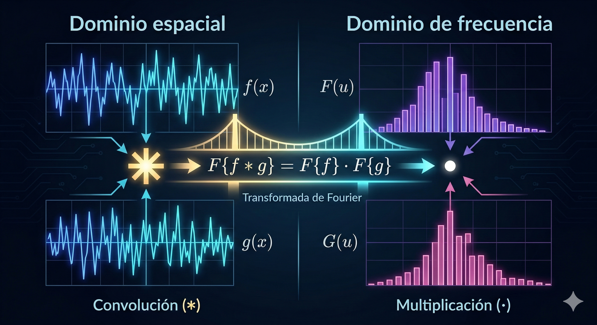

# ¿Qué son las convoluciones? 

En una primera instancia, la convolución puede parecer una forma "peculiar" de multiplicar. La idea central detrás de esta operación no es otra que intentar recoger y combinar información que interactúa cerca de un punto o momento específico.

Para lograr esto, recurrimos a funciones que cumplan ciertas cualidades, principalmente que sus valores puedan acumularse en un rango determinado sin irse hacia el infinito. Es decir, necesitamos funciones medibles que podamos integrar.

En términos generales, una convolución es un producto de dos funciones medibles $f$ y $g$ definidas sobre el espacio euclidiano $ \mathbb{R}^d $. Se formula matemáticamente como la integral del producto de ambas funciones tras la inversión paritaria y traslación de una de ellas (invierto a una y la hago pasar cerca de la otra para ver cómo se portan):

$$ (f * g)(x) = \int_{\mathbb{R}^d} f(x - y)g(y)dy = \int_{\mathbb{R}^d} f(y)g(x - y)dy $$

La ecuación muestra una simetría (demostrable mediante un cambio de variable), lo que significa que la convolución es un operador conmutativo ($f * g = g * f$). Pero, ¿por qué la fórmula nos exige evaluar $g(x - y)$? Esta inversión temporal/espacial y su posterior desplazamiento son el corazón de la mecánica de la convolución. Mejor dicho: ¿Por qué nos interesa voltear los valores de una de ellas y poonerlas a interactuar entre ellas así?

Para comprender esto sin perdernos en la abstracción, veamos cómo opera la variable muda de integración $\tau$ (o $y$) y el desplazamiento $t$ (o $x$) a través de dos ejemplos:

<table>
  <tr>
    <th width="33%">Mecánica Matemática</th>
    <th width="33%">Analogía 1: El Hospital (Acumulación)</th>
    <th width="33%">Analogía 2: La Acústica (El Eco)</th>
  </tr>
  <tr>
    <td valign="top">
      <b>Variable Auxiliar $\tau$:</b> 
      En $\int f(\tau)g(t - \tau) d\tau$, $\tau$ es una variable muda. Recorre todo el dominio barriendo las interacciones, mientras que $t$ es el instante global estático que estamos calculando.
    </td>
    <td valign="top">
      Imagina 3 habitaciones donde das dosis médicas: [3, 2, 1]. Usamos una variable temporal ($\tau$) que "toca la puerta" de cada habitación en un día específico, multiplica los pacientes por la dosis y suma el total de ese día ($t$).
    </td>
    <td valign="top">
      Imagina que gritas en un cañón. $f(\tau)$ es la intensidad de tu voz en el segundo $\tau$. La variable $\tau$ recorre toda la frase que gritaste desde el principio hasta el final.
    </td>
  </tr>
  <tr>
    <td valign="top">
      <b>Inversión $g(-\tau)$ y Traslación $+t$:</b> 
      Para mantener la causalidad, el filtro debe invertirse antes de deslizarse. La traslación $t$ mueve esta ventana invertida a lo largo del dominio.
    </td>
    <td valign="top">
      Como los primeros pacientes en llegar son los que van más avanzados en el tratamiento, debemos <b>invertir</b> la lista de pacientes frente a las habitaciones. Así, al "deslizar" la fila día tras día, la multiplicación iterativa cuadra perfectamente.
    </td>
    <td valign="top">
      $g(t-\tau)$ representa cómo el cañón hace rebotar el sonido. Si escuchas un eco en el tiempo $t$, este corresponde a un grito emitido en $\tau$. El sonido ha viajado durante $(t-\tau)$ segundos. La convolución suma todos los ecos que colisionan exactamente en el instante $t$.
    </td>
  </tr>
</table>

### ¿Cómo podemos dotarle de sentido a todo ésto que acabamos de decir?

Para poder traducir esto a una idea más sencilla, tenemos que ir por partes:

### 1. Espacios de Integrabilidad de Lebesgue y el Teorema de Young
Para que esta integral impropia converja en sentido de Lebesgue y posea propiedades analíticas manejables, las funciones involucradas no pueden ser arbitrarias. 

Los espacios $L^p(\mathbb{R}^d)$ no son colecciones de funciones, sino que agrupan a **clases de equivalencia** de funciones medibles en el sentido de Lebesgue cuya norma $p$-ésima es finita:

$$ \|f\|_p = \left( \int_{\mathbb{R}^d} |f(x)|^p dx \right)^{1/p} < \infty $$

**¿Por qué clases de equivalencia y no funciones individuales?** En la teoría de la medida de Lebesgue, se dice que dos funciones $f$ y $g$ pertenecen a la misma clase de equivalencia si son idénticas "casi por doquier" (almost everywhere). Esto significa que $f(x) = g(x)$ en todos los puntos del dominio, excepto posiblemente en un subconjunto que tiene medida de Lebesgue cero (por ejemplo, puntos aislados, un número finito de discontinuidades, o líneas sin área). 

Esta distinción tiene una implicación estructural importante. Una propiedad fundamental que exige cualquier norma en matemáticas es que $\|f\| = 0$ si y solo si $f$ es el vector nulo (la función que es exactamente cero en todas partes). Si $L^p$ fuera un espacio de funciones ordinarias, podríamos tener una función que sea cero en todo el espacio excepto en un único punto donde vale 1. Su integral (y por ende su norma $\|f\|_p$) sería cero, rompiendo la definición, porque tendríamos una función que no es cero pero tendría valor cero (una degeneración).

Al agrupar las funciones en clases de equivalencia, establecemos matemáticamente que cualquier función que difiera de cero solo en un conjunto de medida nula (es decir, en puntos aislados, un número finito de discontinuidades, o líneas sin área) es, a todos los efectos prácticos, *la misma* que la función nula pura. Esto purifica el espacio, garantizando que $\|f\|_p$ sea una norma verdadera y todo esté bien definido.

### El Espacio de Banach

Esta norma provee la topología necesaria para que $L^p$ tenga la estructura de un **Espacio de Banach**. Un Espacio de Banach es, por definición, un espacio vectorial normado que es topológicamente "completo".

<table>
  <tr>
    <th width="50%">Lenguaje Técnico (Topología de Banach)</th>
    <th width="50%">Analogía</th>
  </tr>
  <tr>
    <td valign="top">
      <b>Espacio Vectorial Normado:</b> Un conjunto cerrado bajo sumas y multiplicaciones, equipado con una norma ($\| \cdot \|$) que provee una noción estricta de distancia. (podemos medir bien)
    </td>
    <td valign="top">
      <b>El Mapa con Regla:</b> Un territorio continuo donde puedes combinar direcciones y siempre tienes una regla métrica infalible para medir la distancia exacta entre dos puntos.
    </td>
  </tr>
  <tr>
    <td valign="top">
      <b>Completitud (Convergencia de Cauchy):</b> Garantiza que toda sucesión de Cauchy converge a un límite dentro del mismo espacio. No hay discontinuidades insalvables. (no hay huecos sin solución, digamos que no puede patinar sobre él y no se va a ir por un orificio)
    </td>
    <td valign="top">
      <b>El Territorio sin Agujeros:</b> En un espacio incompleto podrías caminar hacia un destino que resulta ser un vacío (un agujero en el mapa). En un Espacio de Banach, si tus pasos convergen hacia un punto, ese destino existe garantizadamente bajo tus pies.
    </td>
  </tr>
</table>

### El Teorema de Young y la Estabilidad del Sistema

La viabilidad geométrica de la convolución dentro de estos espacios de Banach están garantizadas por el **Teorema de Young para convoluciones**. Este teorema sobre cardinales establece que si una función (o señal) $f \in L^p(\mathbb{R}^d)$ y una función (o señal) $g \in L^q(\mathbb{R}^d)$ (con $1 \le p, q \le \infty$), entonces la convolución de ambas, $f * g$, existirá casi por todo lado y pertenecerá al espacio $L^r(\mathbb{R}^d)$, siempre y cuando los índices satisfagan la siguiente relación armónica:

$$ 1 + \frac{1}{r} = \frac{1}{p} + \frac{1}{q} $$

Bajo esta condición de equilibrio dimensional, la norma del espacio resultante está estrictamente acotada por el producto de las normas originarias:

$$\|f * g\|_r \le \|f\|_p \|g\|_q$$

**La Intuición:** ¿Por qué es fundamental este teorema? En el análisis de sistemas, procesamiento de señales o machine learning, las funciones representan distribuciones de energía, probabilidades o intensidad de píxeles. La convolución mezcla (o filtra) estas señales. El Teorema de Young es el garante de que el sistema es estable y no "explotará". Nos asegura matemáticamente que si alimentamos el operador con dos entradas de energía bien comportada (acotadas en sus respectivos espacios $p$ y $q$), la salida obligatoriamente estará controlada y confinada en un espacio predecible $r$. 

**La intuición en Machine Learning:** Las funciones son matrices de píxeles (energía luminosa) o filtros de red neuronal. La convolución mezcla ambas. El Teorema de Young garantiza que la operación de filtrado en una Red Convolucional es estable; nos asegura que los gradientes y las activaciones de la red no "explotarán" hacia el infinito tras pasar por múltiples capas de convolución.

**Esbozo de la Demostración:**
La prueba del Teorema de Young es un ejercicio algebraico que se erige sobre la Desigualdad de Hölder. No se evalúa la integral directamente, sino que se recurre a un truco de factorización:

1. **Descomposición del Integrando:** Se toma el valor absoluto del integrando $|f(y)g(x-y)|$ y, en lugar de dejarlo como un producto de dos términos, se factoriza artificialmente dividiendo las funciones en tres componentes, utilizando exponentes fraccionarios meticulosamente calculados en función de $p, q$ y $r$.
2. **Aplicación de Hölder Generalizada:** Se aplica una versión para tres variables de la Desigualdad de Hölder sobre la integral sobre $y$. Esta desigualdad permite acotar la integral de un producto por el producto de integrales individuales de cada componente elevada a su respectiva potencia conjugada.
3. **Cancelación Mágica:** Es aquí donde la condición $1 + 1/r = 1/p + 1/q$ revela su propósito. Estos índices actúan como pesos que balancean la ecuación. Al evaluar las tres integrales separadas, las potencias fraccionarias se cancelan perfectamente, haciendo que las variables se colapsen de vuelta a las normas fundamentales $\|f\|_p$ y $\|g\|_q$, aislando la variable $x$ de tal modo que, al integrar una vez más sobre el espacio exterior para hallar $\|f*g\|_r$, el resultado final queda acotado exactamente por $\|f\|_p \|g\|_q$.

### 2. Dualidad de Fourier, Propiedad de Regularización Asintótica y el Algoritmo FFT

La conexión profunda entre el dominio del espacio (los píxeles de una imagen) y el dominio frecuencial (la rapidez con la que cambian los colores) constituye el núcleo computacional de la convolución. Dada una función $f \in L^1(\mathbb{R}^d)$, su Transformada de Fourier continua $\mathcal{F}$ proyecta la información hacia un espectro de frecuencias: $\hat{f}(\xi) = \int_{\mathbb{R}^d} f(x)e^{-2\pi i x \cdot \xi} dx$.

*Intuición:* Podemos ver la transformada de Fourier como un prisma de cristal. Si le pasamos un rayo de luz blanca (la señal espacial $f(x)$), el prisma la descompone en los colores puros del arcoíris (las frecuencias puras $\xi$) indicando qué tanta intensidad tiene cada color en la composición.

El Teorema de Convolución establece una isometría transformacional:$$\mathcal{F}\{f * g\} = \mathcal{F}\{f\} \cdot \mathcal{F}\{g\}$$ En otras palabras, la convolución (siendo una multiplicación extraña) se convierte en un producto normal cuando llevamos las funciones del espacio de Lebesgue donde viven al espacio de Fourier.
Dicho de otra forma:
establece un "puente mágico" o isometría transformacional entre estos dos mundos:
$$ \mathcal{F}\{f * g\} = \mathcal{F}\{f\} \cdot \mathcal{F}\{g\} $$

  
  
<em>Figura 1: ¿Cómo se ve la convolución?</em>

### La Transformada Rápida de Fourier (FFT) y la Reducción de Complejidad

En el mundo de la computación discreta, aplicar una convolución estándar sobre una imagen de tamaño $N$ iterando una ventana deslizante toma un tiempo proporcional a $O(N^2)$. Si la imagen es grande, esto asfixia al procesador.

El algoritmo **FFT (Fast Fourier Transform)** soluciona esto dividiendo recursivamente la señal en índices pares e impares, logrando calcular las frecuencias en tiempo $O(N \log N)$. Gracias al Teorema de Convolución, las computadoras pueden transformar las imágenes usando FFT, multiplicarlas fácilmente y devolverlas al espacio visual con la FFT Inversa. 

#### Cálculo a Mano: Convolución Circular vs. Multiplicación Frecuencial
Comprobemos esta isometría con dos vectores discretos diminutos. Supongamos una señal de entrada $f = [1, 2]$ y un filtro $g = [0, 1]$.

**Ruta 1: Convolución Espacial Directa (Desplazamiento)**
Al hacer la convolución circular (que asume que el arreglo se repite cíclicamente), deslizamos $g$ sobre $f$:
* Posición 1: $1(0) + 2(1) = 2$
* Posición 2: $1(1) + 2(0) = 1$
* **Resultado: $f * g = [2, 1]$**

**Ruta 2: La Vía Frecuencial (El Teorema en Acción)**
1. Obtenemos la matriz de frecuencias sumando y restando los componentes (esto es la DFT de tamaño 2):
   * $\hat{f} = [1+2, 1-2] = [3, -1]$
   * $\hat{g} = [0+1, 0-1] = [1, -1]$
2. Multiplicamos punto a punto (*element-wise*):
   * $\hat{h} = [3 \times 1, (-1) \times (-1)] = [3, 1]$
3. Aplicamos la DFT inversa (promediando sumas y restas):
   * $h = [\frac{3+1}{2}, \frac{3-1}{2}] = [\frac{4}{2}, \frac{2}{2}]$
   * **Resultado: $h = [2, 1]$**

¡Los resultados son idénticos! Las librerías de Inteligencia Artificial (como *cuDNN* de NVIDIA) deciden dinámicamente si usar ventanas deslizantes o usar FFT dependiendo del tamaño de los tensores para maximizar el rendimiento.

---

## 3. Nivel 2: El Filtro Físico y la Ecuación del Calor

En la física matemática, la convolución es el método para resolver Ecuaciones en Derivadas Parciales (EDP), modelando fenómenos como la electrostática o la termodinámica.

Si bien las matemáticas profundas escapan al núcleo de la visión artificial, hay un puente directo e indispensable: **La Ecuación del Calor es matemáticamente idéntica al Desenfoque Gaussiano (Gaussian Blur)** utilizado en el procesamiento de imágenes médicas.

La Ecuación del Calor bidimensional dicta cómo la energía térmica se propaga en el tiempo $t$:
$$ \frac{\partial u}{\partial t} = \alpha \nabla^2 u $$

La física resuelve esto buscando la "Respuesta al Impulso" del universo frente a una sola chispa de calor microscópica en el tiempo cero. A esta respuesta idealizada se le llama **Función de Green** o *Heat Kernel* continuo:
$$ G(x, y, t) = \frac{1}{4\pi \alpha t} \exp\left(-\frac{x^2 + y^2}{4\alpha t}\right) $$

¿ven la estructura de la ecuación? ¡Es exactamente la función de una Campana de Gauss! En física, para saber cómo se enfría un objeto complejo continuo a lo largo del tiempo, se hace una convolución entre su estado térmico inicial y el Heat Kernel: $u(x,t) = (G * f)$.

**En Visión Artificial**, cuando extraemos características ruidosas de una resonancia magnética, aplicamos un "Filtro Gaussiano" (un kernel discretizado de Green). La convolución "difunde" los valores de los píxeles hacia sus vecinos, exactamente como el calor fluyendo por una placa de metal, alisando los bordes y regularizando la topología preparándola para la segmentación.

## 3. Nivel 3: El Salto a la Discretización y las Redes Neuronales

La transición desde el *continuum* de funciones infinitamente diferenciables hacia la inferencia algorítmica exige la discretización. Cuando las ecuaciones difusivas se subdividen en rejillas (o grillas) para operar sobre imágenes fotográficas o resonancias magnéticas, la integral convolutiva experimenta un cambio analítico convirtiéndose en **sumatorias ponderadas finitas**.

### 3.1. El Colapso de la Continuidad: La Imagen como un Problema *Ill-Posed*

Antes de calcular, debemos entender un reto fundamental en la visión médica. El tejido biológico (un tumor, un vaso sanguíneo) es una variedad topológica continua. Al pasarlo por un escáner MRI, aplicamos un muestreo (regido por el Teorema de Nyquist-Shannon) que colapsa esa continuidad en una cuadrícula rígida de vóxeles (análogo de píxeles pero con volumen) discretos $\mathbb{Z}^n$.

Matemáticamente, reconstruir la forma continua original a partir de una matriz de píxeles es un **problema mal planteado (*ill-posed problem* en el sentido de Hadamard)**. ¿Por qué? Porque múltiples geometrías continuas diferentes pueden generar exactamente la misma matriz de píxeles al ser escaneadas (un fenómeno conocido como *Aliasing*). 

**El reto para las CNNs (U-Net / Seg-UNet):**
Las redes convolucionales asumen "equivariancia a la traslación" (si muevo la entrada, la salida se mueve igual). Sin embargo, en una cuadrícula discreta, si desplazas un tumor **un solo píxel**, la operación de extracción (*Max-Pooling* $2 \times 2$ con salto de 2) arrojará un mapa de características drásticamente diferente. A esto se le llama **Varianza al Desplazamiento (*Shift Variance*)**. 

Por ejemplo, en las arquitecturas que estamos estudiando, Seg-UNet mitiga esto recordando las coordenadas exactas de los índices del *Max-Pooling* para su reconstrucción, pero sigue peleando contra la rigidez de la cuadrícula geométrica. Esta limitación  profunda es precisamente lo que justifica la futura introducción del Análisis Topológico de Datos (TDA), el cual ignora la cuadrícula discreta y evalúa los "agujeros" de forma invariante.

---

### 3.2. La Convolución Discreta Bidimensional (CNNs 2D)

Para una matriz de imagen 2D codificada como $I$ y un filtro espacial (el análogo discreto del Heat Kernel) llamado $K$ de dimensiones impares $(2a+1) \times (2b+1)$, la integral se convierte en la siguiente sumatoria de la ventana deslizante:

$$S (i, j) = (I * K)(i, j) = \sum_{m=-a}^{a} \sum_{n=-b}^{b} I(i-m, j-n) K(m, n) $$

*(Nota de rigor: En Deep Learning, PyTorch o TensorFlow realmente computan una "correlación cruzada" sin invertir el filtro espacialmente. Sin embargo, como los pesos de $K$ se aprenden dinámicamente mediante gradiente descendente, la inversión direccional es asimilada orgánicamente por la red).*

#### Cálculo a Mano: Extracción de un Borde
Realicemos la propagación hacia adelante (*forward pass*) sobre un fragmento. Tenemos una entrada $I \in \mathbb{R}^{4 \times 4}$ y un Kernel detector de bordes verticales $K \in \mathbb{R}^{3 \times 3}$. Operaremos sin *Padding* (no extendemos artificalmente con ceros el borde, ni ceros ni ningún otro valor) y con un paso (*Stride*) de $1$. (Esto es, vamos pixel a pixel)

$$ I = \begin{bmatrix} 3 & 0 & 1 & 2 \\\\ 1 & \mathbf{5} & \mathbf{8} & 9 \\\\ 2 & \mathbf{7} & \mathbf{2} & 5 \\\\ 0 & 1 & 3 & 1 \end{bmatrix}, \quad K = \begin{bmatrix} 1 & 0 & -1 \\\\ 1 & 0 & -1 \\\\ 1 & 0 & -1 \end{bmatrix} $$

Al deslizar $K$ sobre la esquina superior izquierda de $I$ (submatriz $3 \times 3$), el píxel de salida $S(0,0)$ se calcula multiplicando elemento a elemento y sumando:
$S(0,0) = (3)(1) + (0)(0) + (1)(-1) + (1)(1) + (5)(0) + (8)(-1) + (2)(1) + (7)(0) + (2)(-1)$
$S(0,0) = 3 + 0 - 1 + 1 + 0 - 8 + 2 + 0 - 2 = \mathbf{-5}$

Deslizando la ventana por toda la matriz, obtenemos un tensor condensado que mapea las transiciones de intensidad:
$$S = \begin{bmatrix} -5 & -4 \\\\ -10 & -2 \end{bmatrix}$$

  
  
<em>Animación 2: El filtro convolucional K barriendo el tensor I.</em>

---

### 3.3. Tensores Espaciotemporales: Convoluciones Volumétricas (3D)

Procesar resonancias magnéticas cortándolas en rodajas 2D colapsa la profundidad espectral e ignora la coherencia volumétrica del tumor. Las **CNNs 3D** rescatan esto integrando un barrido ortogonal a lo largo de los ejes $X, Y$ y un eje expansivo $Z$ (profundidad de los vóxeles o tiempo temporal $T$ en videos).

Si tenemos un volumen de entrada con $C_{in}$ canales (ej. FLAIR, T1, T2) como un tensor $I(x,y,z,c)$, el bloque operativo suma sobre todas las dimensiones:
$$S(x, y, z) = \sum_{c=0}^{C_{in}-1} \sum_{i=-a}^{a} \sum_{j=-b}^{b} \sum_{k=-d}^{d} I(x+i, y+j, z+k, c) \cdot K(i, j, k, c)$$

**Modelo Mental 3D:** Imagina un cubo de Rubik de $3 \times 3 \times 3$ (nuestra imagen de entrada) siendo escaneado internamente por un cubo de $2 \times 2 \times 2$ (el Kernel). El filtro no solo evalúa el píxel vecino de la derecha, sino también el vóxel que se encuentra "detrás" y "delante" de él en el espacio tridimensional de la cabeza del paciente.

---

### 3.4. El Cuello de Botella Computacional y la Separabilidad

Al aplicar convoluciones hiperdimensionales 3D, el modelo estalla. El hardware asume un brutal crecimiento polinomial geométrico de operaciones aritméticas (FLOPs). Procesar un volumen MRI exige masivos recursos de memoria transaccional RAM y ancho de banda.

Para mitigar esto, surge una revolución analítica: **Las Convoluciones Separables (*Depthwise Separable Convolutions*)**.

Este teorema geométrico escinde radicalmente la pesada multiplicación volumétrica en dos matrices independientes y secuenciales:
1. **Fase *Depthwise* (Espacial):** Un filtro espacial opera exclusivamente sobre cada canal de profundidad por separado. No mezcla modalidades médicas.
2. **Fase *Pointwise* (Integradora):** Un filtro ultracompacto de dimensión $1 \times 1 \times 1$ toma los resultados de la primera fase y los suma, condensando la semántica de todos los canales.

#### Demostración Numérica del Ahorro Absoluto
Asumamos un filtro cúbico $K = 3 \times 3 \times 3$, que entra con $C_{in} = 16$ canales MRI y busca extraer $C_{out} = 32$ mapas de características latentes. Evaluemos la carga paramétrica de aprendizaje.

<table>
  <tr>
    <th width="50%">Convolución 3D Estándar</th>
    <th width="50%">Convolución Separable 3D (Depthwise + Pointwise)</th>
  </tr>
  <tr>
    <td valign="top">
      <b>Fórmula:</b> 
      $K^3 \times C_{in} \times C_{out}$  
      <b>Cálculo:</b> 
      $27 \times 16 \times 32$ 
      <b>Total: 13,824 parámetros</b> (operaciones pesadas entrelazadas)
    </td>
    <td valign="top">
      <b>Fórmula:</b> 
      $(K^3 \times C_{in}) + (1^3 \times C_{in} \times C_{out})$  
      <b>Cálculo:</b> 
      $(27 \times 16) + (1 \times 16 \times 32)$ 
      $432 + 512$ 
      <b>Total: 944 parámetros</b>
    </td>
  </tr>
</table>

El índice de compresión hiperdimensional es de $\frac{13824}{944} \approx 14.6$. ¡Un ahorro de casi **15 veces menos costo aritmético**!

Sacrificar un porcentaje infinitesimal de precisión bruta a cambio de esta optimización es lo que ha democratizado el análisis médico 3D, permitiendo que arquitecturas avanzadas operen en servidores de hospitales clínicos y no solo en supercomputadoras teóricas. Y este ahorro computacional es precisamente lo que permite reservar recursos de procesamiento para inyectar cálculos estructurales complejos, como el **Análisis Topológico de Datos (TDA)** que alimenta a la TDA-SegUNet.

### 3.
### 4.
### 5.

