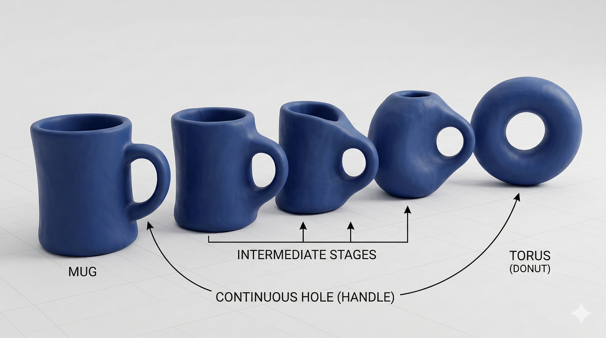

# Análisis Topológico de Datos en la Visión Artificial

La intersección entre la topología algebraica y las redes neuronales profundas representa un cambio fuerte en cómo la Inteligencia Artificial percibe las estructuras espaciales. Mientras que las redes convolucionales (CNNs) sobresalen identificando texturas locales y gradientes a nivel de píxel, son inherentemente "ciegas" a la coherencia topológica global (como garantizar que un vaso sanguíneo no tenga cortes o que un tumor no tenga agujeros artificiales).

El **Análisis Topológico de Datos (TDA)** soluciona esta limitación. Proporciona un marco matemático riguroso, independiente de las coordenadas, para cuantificar la "forma" de los datos y forzar a la red neuronal a respetar la anatomía real.

---

## 1. Nivel 1: El Alfabeto Topológico (Homología y Complejos)

La topología algebraica estudia las propiedades de los espacios que permanecen invariantes bajo deformaciones continuas (estiramientos o flexiones), ignorando métricas rígidas como la distancia o el ángulo. 

  
  
<em>Figura 1: ¿topología?</em>

Para que una computadora analice estos espacios continuos, debemos discretizarlos en unidades finitas de construcción llamadas **Complejos Simpliciales**. Un complejo se arma pegando "símplices":
* **0-símplices:** Vértices (Puntos).
* **1-símplices:** Aristas (Líneas).
* **2-símplices:** Triángulos sólidos.
* **3-símplices:** Tetraedros sólidos.

### El Operador de Frontera y "Agujeros"

El núcleo de la topología algebraica es el **Operador de Frontera ($\partial$)**. Matemáticamente, toma un objeto de dimensión $n$ y devuelve su límite de dimensión $n-1$. Por ejemplo, la frontera de un triángulo sólido (2-símplice) son sus 3 aristas exteriores (1-símplices).

La regla de oro de la topología es que **la frontera de una frontera es siempre nula** ($\partial_n \circ \partial_{n+1} = 0$). Gracias a esta propiedad algebraica, podemos definir qué es un "agujero" real: es un ciclo cerrado de aristas (no tiene frontera) que *no* es el perímetro de un triángulo sólido rellenado. 

### Los Números de Betti ($\beta$)

El álgebra anterior nos permite destilar la topología de cualquier órgano o imagen médica en un conjunto de invariantes llamados **Números de Betti**, que cuentan los "agujeros" en diferentes dimensiones:

<table>
  <tr>
    <th width="15%" align="center">Invariante</th>
    <th width="35%" align="left">Significado Geométrico</th>
    <th width="50%" align="left">Ejemplo Médico</th>
  </tr>
  <tr>
    <td align="center" valign="top"><b>$\beta_0$</b></td>
    <td valign="top"><b>Componentes Conexas</b> (Islas aisladas).</td>
    <td valign="top">Un tumor sólido único debe tener estrictamente $\beta_0 = 1$. Si la red predice fragmentos flotantes, $\beta_0 > 1$ (Error).</td>
  </tr>
  <tr>
    <td align="center" valign="top"><b>$\beta_1$</b></td>
    <td valign="top"><b>Túneles o Ciclos 1D</b> (Anillos).</td>
    <td valign="top">El miocardio (músculo cardíaco) en un corte transversal es un anillo perfecto ($\beta_1 = 1$). Una arteria continua no debe tener bucles cerrados erróneos.</td>
  </tr>
  <tr>
    <td align="center" valign="top"><b>$\beta_2$</b></td>
    <td valign="top"><b>Cavidades 2D</b> (Vacíos encapsulados).</td>
    <td valign="top">Un pulmón enfermo por EPOC forma burbujas de aire atrapadas (múltiples cavidades $\beta_2$).</td>
  </tr>
</table>

---

## 2. Nivel 2: Homología Persistente en Imágenes Médicas

En la vida real, los datos no son figuras geométricas perfectas, sino nubes de puntos o matrices de píxeles ruidosas. Para encontrar la topología subyacente, el TDA utiliza la **Homología Persistente**, la cual no mira el objeto a una sola escala, sino que evalúa simultáneamente un espectro continuo de escalas para separar la estructura real del ruido.

### Complejos Cúbicos: La Estructura Nativa de la Resonancia Magnética

Si tenemos una nube de puntos dispersa en 3D (como un escaneo LIDAR), lo correcto es usar complejos de *Vietoris-Rips* o *Alpha*, uniendo puntos con esferas en crecimiento. 
Sin embargo, **para imágenes médicas y CNNs, esto es un error computacional**. Construir triángulos sobre una resonancia magnética $256 \times 256 \times 256$ exige un tiempo $O(2^n)$ que haría explotar la memoria RAM de cualquier GPU.

La solución es el **Complejo Cúbico**. Como una imagen ya es una cuadrícula perfecta, en lugar de triángulos, usamos píxeles (cuadrados 2D) y vóxeles (cubos 3D). La complejidad computacional se vuelve lineal, ideal para la visión artificial.

### La Filtración de Subnivel (El Cálculo a Mano)

¿Cómo extrae la computadora los números de Betti de una imagen de escala de grises? Usando una "Filtración de Subnivel". 

Imagina que la imagen MRI es un paisaje montañoso, donde el brillo del píxel es la "altitud". El algoritmo inunda este paisaje bajando un nivel de agua imaginario (un umbral paramétrico $t$). A medida que el agua baja, "nacen" islas ($\beta_0$) y cuando se conectan formando lagos, "nacen" agujeros ($\beta_1$), hasta que todo se seca y los agujeros "mueren" al rellenarse.

*insertar algoritmo de persistencia*

**Simulemos a mano una matriz $3 \times 3$ (Un tumor anular brillante con centro oscuro):**

$$M = \begin{bmatrix} 0.2 & 0.8 & 0.1 \\\\ 0.9 & \mathbf{0.0} & 0.7 \\\\ 0.1 & 0.8 & 0.2 \end{bmatrix}$$

Barrido del umbral $t$ descendente (se revelan píxeles $\ge t$):

1. **$t = 0.9$:** Aparece el píxel $(2,1)$. **Nace un componente conexo**. ($\beta_0 = 1$).
2. **$t = 0.8$:** Aparecen $(1,2)$ y $(3,2)$. Son puntos aislados. **Nacen dos nuevas islas**. ($\beta_0 = 3$).
3. **$t = 0.7$:** Aparece $(2,3)$. **Nace otra isla**. ($\beta_0 = 4$).
4. **$t = 0.2$:** Aparecen las esquinas $(1,1)$ y $(3,3)$. Esto conecta las islas superior e inferior con los lados. El grupo se fusiona por la "Regla del Más Viejo" (el componente más joven muere al unirse al más viejo). Mueren dos islas. ($\beta_0 = 2$).
5. **$t = 0.1$:** Aparecen $(1,3)$ y $(3,1)$. El anillo se cierra por completo. Todas las islas se vuelven una sola. ($\beta_0 = 1$). 
   * **¡Evento Topológico Crítico!** El anillo rodea completamente al centro oscuro $(2,2)$. **Nace un ciclo cerrado o agujero 1D** ($\beta_1 = 1$).
6. **$t = 0.0$:** Aparece el centro $(2,2)$. El agujero se rellena de "tejido". **El agujero muere** ($\beta_1 = 0$).

  <video width="600" controls autoplay loop muted>
    <source src="../videos/persistencia_gif.mp4", type="video/mp4">
  </video>
  
<em>Animación 1: Filtración de Subnivel en un Complejo Cúbico 3x3. Nacimiento y muerte de características homológicas.</em>

### El Diagrama de Persistencia

Toda la biografía de nacimientos ($b$) y muertes ($d$) de la filtración anterior se grafica en un espacio 2D llamado **Diagrama de Persistencia**. La "vida útil" de una característica topológica se define como $|b - d|$. 
* Las características que duran mucho tiempo reflejan la anatomía real subyacente. 
* Las características que nacen y mueren casi inmediatamente (cerca de la línea diagonal $x=y$) son descartadas matemáticamente como ruido de la resonancia.

## 3. Nivel 3: La Fusión con Deep Learning (TDA-SegUNet)

### 3.1. El Problema de la Vectorización

Hasta este punto, hemos extraído la topología de la imagen y la hemos graficado en un **Diagrama de Persistencia**. Matemáticamente, este diagrama es un "multiconjunto" de puntos bidimensionales $(nacimiento, muerte)$ que puede tener cualquier cantidad de elementos (dependiendo de cuántos agujeros tenga la imagen).

Aquí surge un choque fundamental con el Deep Learning: **Las Redes Convolucionales (CNNs) no comprenden la longitud variable.** Una U-Net está programada para ingerir tensores de tamaño estrictamente fijo y estructurado (ej. $256 \times 256 \times C$). No puede procesar una lista aleatoria de puntos dispersos.

### 3.2. Imágenes de Persistencia (PI) y el Teorema de Estabilidad

Para solucionar esta incompatibilidad de formatos, debemos proyectar el Diagrama de Persistencia hacia un espacio vectorial euclidiano de dimensiones fijas. Esto se logra creando una **Imagen de Persistencia (PI)**. 

El proceso sigue una transformación matemática:

<table>
  <tr>
    <th width="50%">1. Transformación de Coordenadas</th>
    <th width="50%">2. Vectorización Gaussiana y Discretización</th>
  </tr>
  <tr>
    <td valign="top">
      Primero, rotamos el diagrama aplicando una transformación lineal $T(x,y) = (x, y-x)$.   
      Esto cambia los ejes de <i>(Nacimiento, Muerte)</i> a <b>(Nacimiento, Persistencia)</b>. Así, las características topológicas más importantes (las que viven más tiempo) quedan en la parte superior del gráfico, y el ruido queda aplastado contra el eje X horizontal.
    </td>
    <td valign="top">
      Sobre cada punto transformado $u$, anclamos una función Gaussiana 2D $\phi_u$, multiplicada por un peso que aumenta según su persistencia.  
      $$\rho_{PD}(z) = \sum f(u)\phi_u(z)$$ 
      La superposición de estas campanas de Gauss crea una "superficie de calor" continua. Finalmente, superponemos una cuadrícula de píxeles sobre esta superficie y la integramos, obteniendo un tensor (tensor en el sentido de computación) 2D de dimensiones fijas.
    </td>
  </tr>
</table>

**¿Por qué es vital este proceso? El Teorema de Estabilidad**
Inyectar datos a una red neuronal es peligroso si los datos son inestables. El *Teorema de Estabilidad de Cohen-Steiner* garantiza que las Imágenes de Persistencia son **Lipschitz continuas** respecto a la Distancia de Wasserstein. 
En términos clínicos: si el escáner MRI tiene un poco de ruido blanco o un artefacto de movimiento, el Teorema de Estabilidad asegura que la Imagen de Persistencia no sufrirá una mutación catastrófica. La topología inyectada a la red será invariablemente sólida.

  
  
<em>Animación 2: Transformación de un Diagrama de Persistencia disperso a un Tensor PI (Imagen de Persistencia).</em>

---

### 3.3. La Arquitectura Final: TDA-SegUNet

Con la topología convertida en un tensor estable matricial (la PI), podemos integrarla al motor de la red neuronal. La arquitectura **TDA-SegUNet** logra esto modificando estratégicamente el sustrato de entrada (*Input Layer*).

En una U-Net médica tradicional para segmentación de tumores cerebrales (BraTS), el tensor de entrada agrupa los canales de la resonancia:
$$X_{tradicional} = \text{FLAIR} \oplus \text{T1ce} \quad \text{(Dimensión: } H \times W \times 2 \text{)}$$

**El Fuego Cruzado Topológico:**
TDA-SegUNet procesa offline la imagen, calcula la filtración cúbica y genera dos Imágenes de Persistencia fijas: una para $\beta_0$ (islas de tejido) y otra para $\beta_1$ (anillos tumorales). Estos tensores se concatenan en profundidad con la imagen original:
$$X_{TDA} = \text{FLAIR} \oplus \text{T1ce} \oplus PI_{\beta_0} \oplus PI_{\beta_1} \quad \text{(Dimensión: } H \times W \times 4 \text{)}$$

#### El Impacto en la Función de Aprendizaje
Al alimentar este tensor hiperdimensional enriquecido al *Encoder*, los filtros convolucionales se ven forzados a optimizar sus pesos iterativos observando dos universos simultáneamente:
1. **Universo Local:** Extraen texturas, bordes y gradientes de intensidad de la MRI.
2. **Universo Global:** Leen el "mapa de reglas" topológico apriorístico de las PIs. 

Si la CNN intenta cometer el error local de crear un agujero falso en el núcleo necrótico de un meningioma masivo, el canal $PI_{\beta_1}$ (que indica que originalmente no hay agujeros dominantes en esa región) actúa como un limitador matemático. Los gradientes de retropropagación castigarán ese falso positivo.

### 3.4. Alternativas Dinámicas: Topological Loss Functions

Como complemento a TDA-SegUNet, la investigación en 2025 ha introducido la penalización topológica directamente en la función de pérdida (Loss Function), sin modificar los canales de entrada.

En lugar de usar únicamente *Cross-Entropy* o *Dice Loss*, se incorporan métricas como **clDice (Centerline Dice)** o restricciones de la **Característica de Euler ($\chi = \beta_0 - \beta_1$)**. La red genera un mapa de probabilidad continuo; se calcula la topología de esa predicción *en vivo* y, si difiere de la topología biológica real conocida (ej. un vaso sanguíneo cortado en dos), la función de pérdida penaliza severamente a la red, forzando a los pesos a soldar el tejido roto en la siguiente época de entrenamiento.

### Conclusión

La arquitectura TDA-SegUNet no es un simple truco de ingeniería; es el amalgamiento histórico entre la abstracción matemática absoluta (la topología) y la inferencia estocástica heurística (el deep learning). Al enseñar a las máquinas no solo a ver el "color" de un tumor, sino a comprender rigurosamente su forma geométrica inherente, se erradican los errores morfológicos catastróficos, elevando la Inteligencia Artificial a los niveles de fiabilidad requeridos por la medicina.